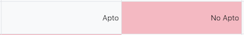

# Moodle Grader Tweaks

Moodle Grader Tweaks es una extensión de Chrome que optimiza la vista de los tutores en la plataforma Moodle. La extensión proporciona varias mejoras (tweaks) que facilitan la navegación y la interacción con los foros y las tareas en Moodle.

## Tweaks disponibles

1. **Responder en privado por defecto:** Esta función marca automáticamente la opción "Responder en privado" en los foros cada vez que se hace clic en algún botón "responder".

2. **Destacar opción de calificar:** Esta función muestra un recuadro rojo en los selectores (selectbox) de un foro que estén con el contenido "calificar..." junto a un texto "calificar..." que permite buscar.

3. **Destacar opción No Apto en vista calificaciones:** Esta función cambia el color de fondo de los elementos `<td>` con los atributos `class="column-grade"` y el contenido de texto "No Apto" a rosa claro para facilitar su localización.

## Instalación

Para instalar la extensión Moodle Grader Tweaks desde los lanzamientos, sigue estos pasos:

1. Dirígete a la página de [Releases](https://github.com/erseco/moodle-grader-tweaks/releases) del repositorio de GitHub donde se encuentra la extensión.
2. Descarga el archivo `.zip` de la última versión disponible en la sección de Assets.
3. Abre Chrome y ve a la página de extensiones: chrome://extensions
4. Habilita el modo de desarrollador en la esquina superior derecha de la página de extensiones.
5. Si has descargado el archivo `.zip`, descomprímelo en una carpeta de tu elección. Arrastra y suelta la carpeta descomprimida en la página de extensiones de Chrome.
7. La extensión Moodle Grader Tweaks ahora debería estar instalada y activa en Chrome.

## Configuración

Para configurar las opciones de la extensión, haz clic en el ícono de Moodle Grader Tweaks en la barra de herramientas de Chrome y selecciona "Configuración". Desde allí, podrás activar o desactivar los tweaks disponibles y especificar en qué URL quieres que actúe la extensión.
